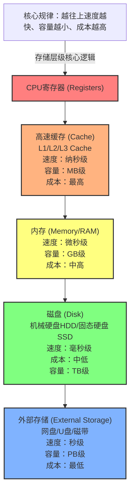

# Go 内存管理

## 计算机获取数据




## 内存分级管理

Go语言中，采用内存分级策略，将内存大小进行分级，针对每级大小维护独立的空闲列表。可以快速定位合适大小的空闲空间，并且也分散了加锁解锁的压力。

### Go语言内存管理的基本单位-mspan

操作系统管理内存的基本单元是Page(页),在64位操作系统中，页的默认范围是8KB。如果Go程序需要分配8字节的内存，它不会向操作系统申请8字节的内存，只能一次性申请8KB的内存空间。所以Go一般会将该page大小的空间映射到mspan概念中。

mspan是一个或者多个`Page`。mspan底层是一个双向链表。同时也存储了该mspan等级类别，比如不同类型的mspan负责分配不同大小的内存空间。

mspan一共有67个等级类型。

```go
// class  bytes/obj  bytes/span  objects  tail waste  max waste  min align
//     1          8        8192     1024           0     87.50%          8
//     2         16        8192      512           0     43.75%         16
//     3         24        8192      341           8     29.24%          8
//     4         32        8192      256           0     21.88%         32
//     5         48        8192      170          32     31.52%         16
//     6         64        8192      128           0     23.44%         64
//     7         80        8192      102          32     19.07%         16
//     8         96        8192       85          32     15.95%         32
//     9        112        8192       73          16     13.56%         16
//    10        128        8192       64           0     11.72%        128
//    11        144        8192       56         128     11.82%         16
//    12        160        8192       51          32      9.73%         32
//    13        176        8192       46          96      9.59%         16
//    14        192        8192       42         128      9.25%         64
//    15        208        8192       39          80      8.12%         16
//    16        224        8192       36         128      8.15%         32
//    17        240        8192       34          32      6.62%         16
//    18        256        8192       32           0      5.86%        256
//    19        288        8192       28         128     12.16%         32
//    20        320        8192       25         192     11.80%         64
//    21        352        8192       23          96      9.88%         32
//    22        384        8192       21         128      9.51%        128
//    23        416        8192       19         288     10.71%         32
//    24        448        8192       18         128      8.37%         64
//    25        480        8192       17          32      6.82%         32
//    26        512        8192       16           0      6.05%        512
//    27        576        8192       14         128     12.33%         64
//    28        640        8192       12         512     15.48%        128
//    29        704        8192       11         448     13.93%         64
//    30        768        8192       10         512     13.94%        256
//    31        896        8192        9         128     15.52%        128
//    32       1024        8192        8           0     12.40%       1024
//    33       1152        8192        7         128     12.41%        128
//    34       1280        8192        6         512     15.55%        256
//    35       1408       16384       11         896     14.00%        128
//    36       1536        8192        5         512     14.00%        512
//    37       1792       16384        9         256     15.57%        256
//    38       2048        8192        4           0     12.45%       2048
//    39       2304       16384        7         256     12.46%        256
//    40       2688        8192        3         128     15.59%        128
//    41       3072       24576        8           0     12.47%       1024
//    42       3200       16384        5         384      6.22%        128
//    43       3456       24576        7         384      8.83%        128
//    44       4096        8192        2           0     15.60%       4096
//    45       4864       24576        5         256     16.65%        256
//    46       5376       16384        3         256     10.92%        256
//    47       6144       24576        4           0     12.48%       2048
//    48       6528       32768        5         128      6.23%        128
//    49       6784       40960        6         256      4.36%        128
//    50       6912       49152        7         768      3.37%        256
//    51       8192        8192        1           0     15.61%       8192
//    52       9472       57344        6         512     14.28%        256
//    53       9728       49152        5         512      3.64%        512
//    54      10240       40960        4           0      4.99%       2048
//    55      10880       32768        3         128      6.24%        128
//    56      12288       24576        2           0     11.45%       4096
//    57      13568       40960        3         256      9.99%        256
//    58      14336       57344        4           0      5.35%       2048
//    59      16384       16384        1           0     12.49%       8192
//    60      18432       73728        4           0     11.11%       2048
//    61      19072       57344        3         128      3.57%        128
//    62      20480       40960        2           0      6.87%       4096
//    63      21760       65536        3         256      6.25%        256
//    64      24576       24576        1           0     11.45%       8192
//    65      27264       81920        3         128     10.00%        128
//    66      28672       57344        2           0      4.91%       4096
//    67      32768       32768        1           0     12.50%  
```

- bytes/obj
  bytes/obj代表着可以分配内存空间的最大值，比如8代表着：可以一次性分配8字节对象空间。
- bytes/span
  bytes/span代表着该级别的span中的存储大小，比如8192为8K代表着一个Page。
- objects
  表示一个span可以存储多少个对象。span在分配时，会将整个span切分为objecs个数的元素，每个元素存储一个对象。
- tail waste
  代表着尾部浪费。比如说sizeclass 1 总大小为8192KB，可以分配1024个8字节对象，没有浪费空间。但是sizeclass 3， 总大小为8192KB,可以分配8192/24≈341个对象，但是浪费了8个字节空间。
- max waste
  代表最大浪费率，比如sizeclass 1，固定分配8字节对象内存空间，但是如果为了1字节对象分配空间只能使用sizeclas 1mspan分配对象空间，这时候就浪费了7字节。


为了更方便地对mspan进行管理，加速mspan对象的分配和访问，Go采用了三级别管理结构，分别是mcache、mcentral、mheap。

## mcache

在Go语言中，每一个P拥有一个mcache，每一个mcache用来维护各个级别的mspan，其中各个级别的mspan只有一个。由于在同一时刻一个P只有一个goroutine在运行，所以在使用mcache为对象分配空间时，是不需要加锁与释放锁的。除了sizeclass0外，mcahce的mspan都来自mcentral。

其中mcache中包含两组mspan，一组mspan列表中所表示的对象包含了指针，另一组mspan列表中所表示的对象不含指针，主要就是为了提高GC扫描的性能，对于不包含指针的span没有必要去扫描。

根据对象是否包含指针，将对象分为`noscan`和`scan`两种类型，前者代表没有指针，后者代表有指针。


graph TD
    subgraph Goroutine 需要内存
        G[Goroutine]
    end

    subgraph Per-P Local Cache
        mcache("mcache (Per-P Local Cache)")
        mcache -- 包含多个 FreeList --> list8Bytes[FreeList for 8-byte objects]
        mcache -- ... --> listOtherSizes[FreeList for other SizeClasses]
    end

    subgraph Memory Spans
        span_ptr[mspan 8KB]
        span_nonptr[mspan 8KB]

        list8Bytes -- 可包含 --> span_ptr
        list8Bytes -- 可包含 --> span_nonptr

        span_ptr_meta{"mspan Metadata (Type: Pointer-rich)"}
        span_nonptr_meta{"mspan Metadata (Type: Non-pointer)"}

        span_ptr --> span_ptr_meta
        span_nonptr --> span_nonptr_meta

        span_ptr --- object_ptr_1[Object 8 bytes - Contains Pointers]
        span_ptr --- object_ptr_2[Object 8 bytes - Contains Pointers]
        span_ptr --- ...

        span_nonptr --- object_nonptr_1[Object 8 bytes - No Pointers]
        span_nonptr --- object_nonptr_2[Object 8 bytes - No Pointers]
        span_nonptr --- ...
    end

    subgraph Garbage Collector
        GC[Garbage Collector]
    end

    G -- 请求分配对象 (e.g., 8 bytes, type T) --> mcache
    mcache -- 找到匹配 T 的 span --> span_ptr_or_nonptr[Chosen mspan]

    span_ptr_or_nonptr -- 返回空闲对象 --> G
    
    GC -- 扫描所有已分配 mspan --> span_ptr
    GC -- 根据 Metadata 发现 --> span_ptr_meta
    span_ptr_meta -- 精确扫描对象内部 --> object_ptr_1
    object_ptr_1 -- 发现并追踪 --> OtherObjects[其他被引用的对象]

    GC -- 扫描所有已分配 mspan --> span_nonptr
    GC -- 根据 Metadata 发现 --> span_nonptr_meta
    span_nonptr_meta -- (跳过或快速扫描) --> object_nonptr_1
    object_nonptr_1 -- (无需追踪内部指针) --> X

    style G fill:#bbf,stroke:#333,stroke-width:2px
    style mcache fill:#ccf,stroke:#333,stroke-width:2px
    style list8Bytes fill:#eef,stroke:#999
    style listOtherSizes fill:#eef,stroke:#999
    
    style span_ptr fill:#ffd,stroke:#333
    style span_nonptr fill:#ffd,stroke:#333
    style span_ptr_meta fill:#fdd,stroke:#333,font-weight:bold
    style span_nonptr_meta fill:#fdd,stroke:#333,font-weight:bold

    style object_ptr_1 fill:#afa,stroke:#333
    style object_ptr_2 fill:#afa,stroke:#333
    style object_nonptr_1 fill:#ccc,stroke:#333
    style object_nonptr_2 fill:#ccc,stroke:#333
    
    style GC fill:#dfd,stroke:#333,stroke-width:2px
    style OtherObjects fill:#bbf,stroke:#333
    style X fill:#ddd,stroke:#999,stroke-dasharray:5


mcache在初始化时是没有任何span的，在使用过程中会动态的从central中获取并且缓存下来。根据使用情况不同，其中的span数量也是不同的。比如某个P中的mcache中class 1比其它类型的span数量多，那么意味着该P中的小对象分配的比较多。

## mcentral

mcentral是所有P共享的。mcentral对象收集所有给定规格的mspan。

在 Go 的底层结构中，每个 `mcentral` 管理着同一种 `sizeclass` 的 span，它把它们分成两类：

1. **`partial` (部分空闲链表)**：还有剩余空间的 span。其包含两个类型的链表，一种是swept链表（被GC清理的链表），另一种为unswept（未被GC清理的）链表。
2. **`full` (完全满标链表)**：一个坑位都没有了的 span。

这种区分方式为了更快的分配span到mcache中。

mcache从mcentral中获取span的步骤：

- 尝试从partial链表中的swept链表中获取span
  如果找到有span就返回个mcache
- 触发sweep
  如果partial swept链表为空，mcentral会尝试从partial unswept链表中寻找
  它会尝试清扫一个span，清扫过程中会检查哪些对象已经不再引用，并且释放他们。
  如果清扫之后，发现该span有空的位置，那么就返回它
- 从full 链表捡漏
  如果partial 链表中确实找不到任何有位置的span，那它会在full unswept中去尝试清理
  有时候某个span在gc前确实是满的，但是如果gc之后可能有的span就有空的位置了，那么它就会从full变成了partial。
- 最后在central实在找不到，那么central就会向mheap中去申请了。

## mheap

每一个central会管理一种级别的span，也就是说系统中会有多个central，而所有central都是由mheap进行管理。mheap底层就是一个数组。
    mheap不仅仅是管理central，也会管理大对象。一般大对象是直接通过mheap进行分配的。


graph LR
    MHEAP[mheap] --- L1[级别 1]
    MHEAP --- L2[级别 2]
    MHEAP --- LD[...]
    MHEAP --- L66[级别 66]

    %% 级别 1 展开
    L1 --- L1_FULL[mcentral无空闲链表]
    L1 --- L1_PART[mcentral空闲链表]
    
    L1_FULL --> L1_F1[8] --> L1_F2[8] --> L1_F3[8]
    L1_PART --> L1_P1[8] --> L1_P2[8] --> L1_P3[8]

    %% 级别 2 展开
    L2 --- L2_FULL[mcentral无空闲链表]
    L2 --- L2_PART[mcentral空闲链表]
    
    L2_FULL --> L2_F1[16] --> L2_F2[16] --> L2_F3[16]
    L2_PART --> L2_P1[16] --> L2_P2[16] --> L2_P3[16]

    %% 级别 66 展开
    L66 --- L66_FULL[mcentral无空闲链表]
    L66 --- L66_PART[mcentral空闲链表]
    
    L66_FULL --> L66_F1[32768] --> L66_F2[32768] --> L66_F3[32768]
    L66_PART --> L66_P1[32768] --> L66_P2[32768] --> L66_P3[32768]

  



## 四级内存管理

根据对象大小，Go将堆内存分成了，HeapArea、chunk、span、page 4种内存块进行管理。

- HeapArea内存块最大，其大小与平台有关，在Unix64位操作系统中占据64MB。
- chunk占据512KB
- span根据大小不同而不同
- page为8KB


内存分配时，将对象分为**微小对象、小对象、大对象**

### 微小对象分配

Go语言将对象大小小于16字节的对象划分为微小对象。对于大小小于16字节的对象，通过选择类型为class 2的span进行分配。

首先class 2的span存储的对象大小为16字节，如果微小对象大小为8字节，那么mcache会分配一个16字节大小的对象给该变量，如果接下来又有一个大小为4字节的对象需要分配空间，那么mcache则优先判断上一个分配的对象空间有没有剩余部分（对齐之后的大小），如果有那么直接将该空间分配给该对象，如果没有则mcache重新在相应的span种找一个空闲的空间分配给该对象。

并且每一个mspan都有一个allocCache的字段，该字段为uint64，表示mspan某一个对象空间是否已经被分配，如果被分配了那么相应的位数为1。如果没有那么就为0，因为该字段之后64位，所以能缓存的大小也就


### 大对象分配

大对象（大小>32KB）分配，是由mheap直接进行分配，不需要经过mcache->mcentral->mheap。


## 参考书籍

- *Hand-On High Performance With Go*
- 《深入理解Go》
- 《深入浅出Go核心编程》
- *Effective Go*
- 《Go 语言底层原理剖析》
- 《Go专家编程》
- 《Go语言设计与实现》
- 《深入解析Go》